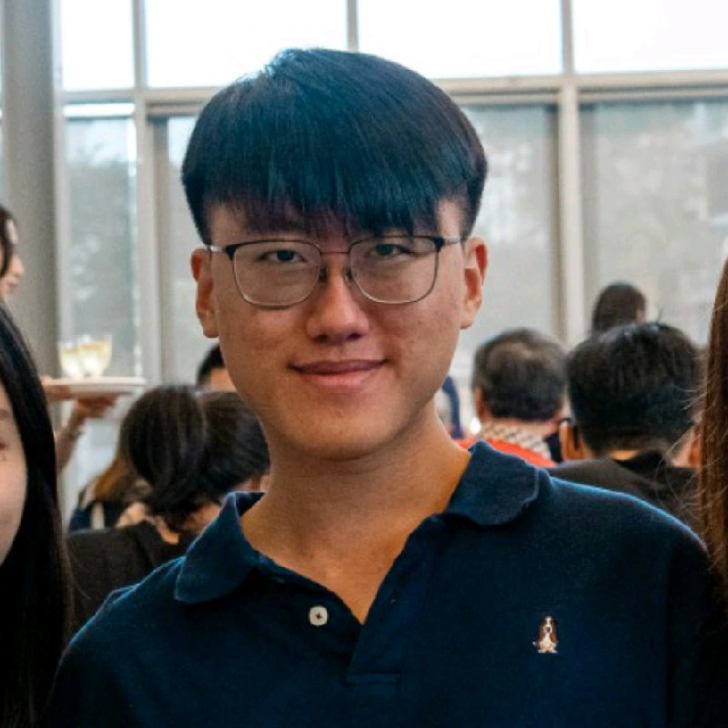
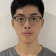

# About Us

We are a team based in the [School of Computing, National University of Singapore](http://www.comp.nus.edu.sg).

You can reach us at the email `seer[at]comp.nus.edu.sg`

## Project team

### Larry Gaw

[[homepage](http://www.comp.nus.edu.sg/~damithch)]
[[github](https://github.com/larrygaw)]
[[portfolio](team/larrygaw.md)]

* Role: Developer

### Jane Doe

[[github](http://github.com/johndoe)]
[[portfolio](team/larrygaw)]

* Role: Team Lead
* Responsibilities: UI

### Johnny Doe

[[github](http://github.com/johndoe)]
[[portfolio](team/larrygaw)]

* Role: Developer
* Responsibilities: Data

### Martin Tan

[[github](http://github.com/amptea)]
[[portfolio](team/martin.md)]

* Role: Developer
* Responsibilities: Dev Ops + Threading

### James Doe

[[github](http://github.com/johndoe)]
[[portfolio](team/larrygaw)]

* Role: Developer
* Responsibilities: UI
