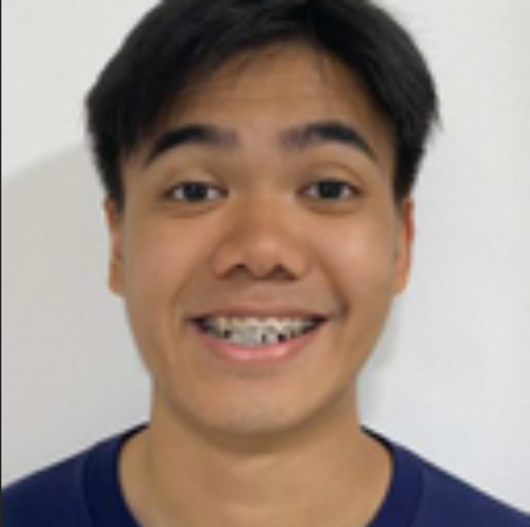

# About Us

We are a team based in the [School of Computing, National University of Singapore](http://www.comp.nus.edu.sg).

You can reach us at the email `seer[at]comp.nus.edu.sg`

## Project team

### Larry Gaw

[[homepage](http://www.comp.nus.edu.sg/~damithch)]

[[github](https://github.com/larrygaw)]
[[portfolio](team/larrygaw.md)]

* Role: Developer
* Responsibilities: UI

### Tan Kuan Feng

[[github](http://github.com/goodguykf)]
[[portfolio](team/goodguykf.md)]

* Role: Developer
* Responsibilities: UI

### Aaron Goh Chong Jun

[[github](http://github.com/aaroncjgoh)]
[[portfolio](team/aaroncjgoh.md)]

* Role: Developer
* Responsibilities: Data

### Martin Tan

[[github](http://github.com/amptea)]
[[portfolio](team/martin.md)]

* Role: Developer
* Responsibilities: Dev Ops + Threading